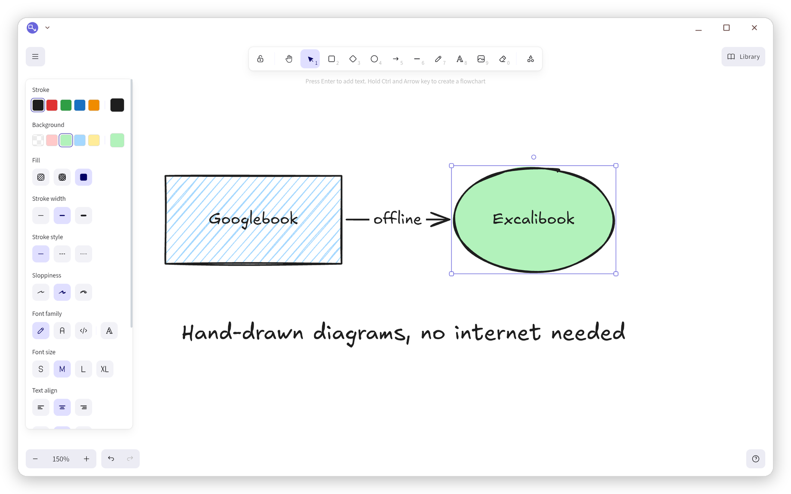
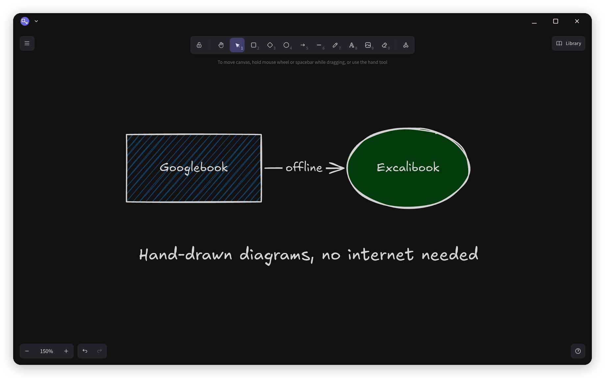
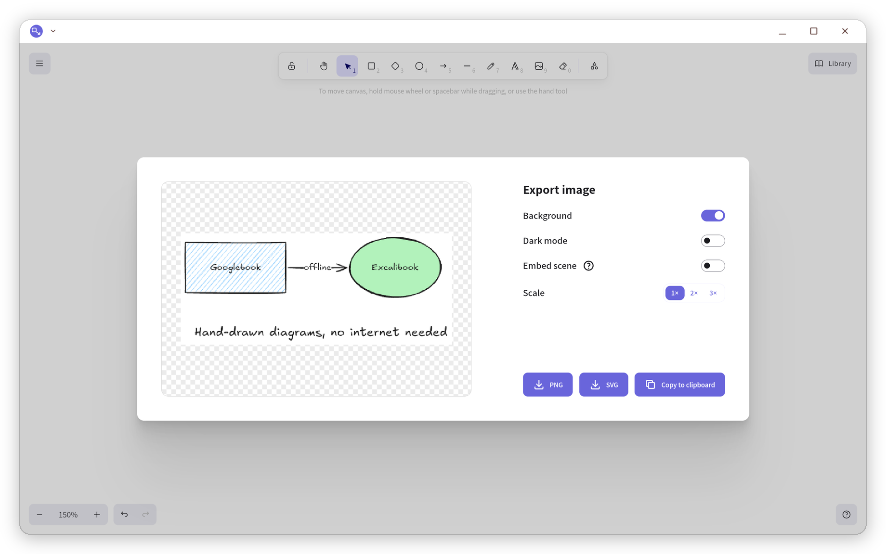
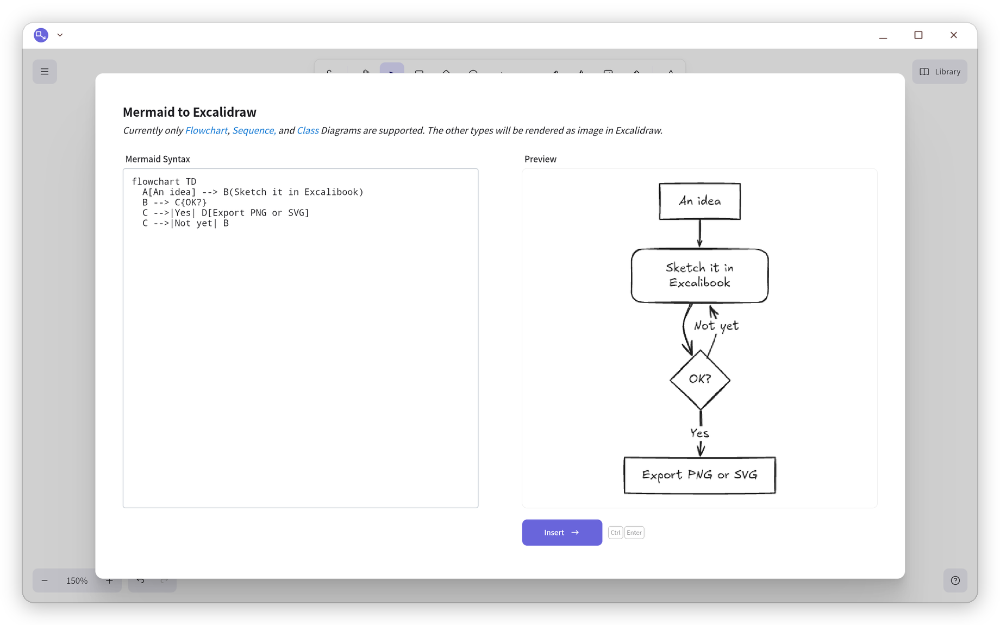
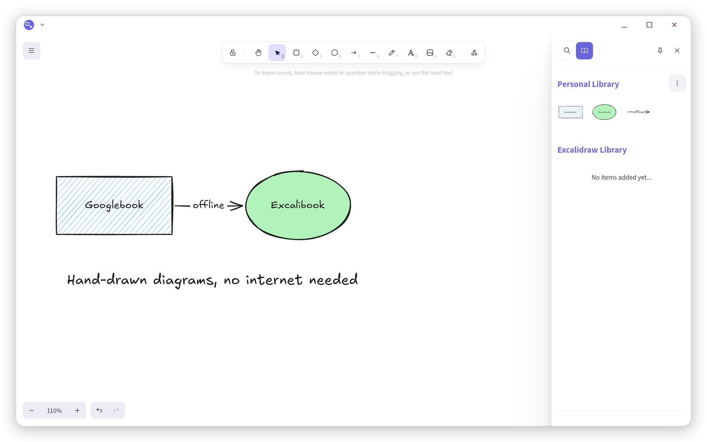

<p align="center">
  
</p>

<h1 align="center">Excalibook</h1>

<p align="center">
  <b>Excalidraw's hand-drawn whiteboard as a Googlebook app, offline.</b><br>
  <a href="https://github.com/excalidraw/excalidraw">Excalidraw</a>, the open-source virtual whiteboard, in a
  desktop window: one download for every Googlebook, Intel and Snapdragon.
</p>

<p align="center">
  <a href="../../releases/latest/download/Excalibook.apk"><b>⬇ Download Excalibook.apk</b></a>
  &nbsp;·&nbsp; <a href="#install">Install</a>
  &nbsp;·&nbsp; <a href="#privacy">Privacy</a>
  &nbsp;·&nbsp; <a href="CHANGELOG.md">What's new</a>
  &nbsp;·&nbsp; <a href="#licenses">Licenses</a>
</p>

<p align="center">
  
  
  
  
  
</p>

<p align="center"><sub>A personal project by <a href="https://github.com/jessejamesjohnston">Jesse Johnston</a>, published as
<a href="https://merrimentlabs.com">Merriment Labs</a>, built, tested and released on an Acer Googlebook 14. Not affiliated
with or endorsed by any employer, or by Excalidraw (<a href="#about-this-project">more</a>).</sub></p>

<p align="center">
  
</p>

## What it is

Excalibook is Excalidraw's editor built as an Android app for Googlebooks. Sketch diagrams,
wireframes and flowcharts with the shapes, arrows, text and hand-drawn style Excalidraw is known
for, in a resizable window, with your keyboard, trackpad, touch screen or pen.

- **Offline by design.** The app has no internet permission. Your drawings stay on the Googlebook
  until you save or share them.
- **Picks up where you left off.** The drawing on the canvas is kept as you work, so closing the
  window or restarting the Googlebook loses nothing.
- **Real files.** Open and save `.excalidraw` drawings and export PNG and SVG. Ctrl+S saves back to
  the file you opened; Save as starts in Download.
- **The library.** Keep reusable shapes and import `.excalidrawlib` files.
- **Mermaid to Excalidraw.** Paste a Mermaid flowchart, sequence or class diagram and get an
  editable drawing, all on the device.

Live collaboration, share links, the online library browser and the AI tools need Excalidraw's
servers, so they aren't in Excalibook. Everything else is Excalidraw as you know it.

<p align="center">
  
</p>

### Export

PNG or SVG, with or without the background, light or dark, at 1x to 3x, or straight to the
clipboard. Turn on **Embed scene** and the image (`name.excalidraw.png`) opens in Excalibook again
as an editable drawing.

<p align="center">
  
</p>

### Mermaid to Excalidraw

Paste a flowchart, sequence or class diagram written in Mermaid and insert it as hand-drawn shapes
you can keep editing.

<p align="center">
  
</p>

### The library

Select shapes and add them to the library to reuse them in any drawing. Open a `.excalidrawlib`
file to import someone else's.

<p align="center">
  
</p>

## Made for the Googlebook

- **A desktop window.** Resize it or move it to another display and the drawing stays put, nothing
  reloads. The caption bar takes the canvas color, light or dark.
- **Keyboard first.** Every Excalidraw shortcut works (`?` lists them). Escape never closes the
  window, and the Back gesture closes an open menu, dialog or sidebar before the window.
- **Files that open in Excalibook.** Open a `.excalidraw` file from Files and choose Excalibook,
  **Always**: from then on drawings open straight in Excalibook. It registers for Excalidraw's own
  file names only, never for every unknown file.
- **Careful with your work.** Opening a file only asks first when the canvas has changes that
  aren't saved. Saving back to a file puts the old version back if the write fails.
- **Dark mode follows the system,** unless you've picked the other theme yourself.
- **One APK** for Intel and Snapdragon Googlebooks: no native code.

## Install

1. On your Googlebook, download **[Excalibook.apk](../../releases/latest/download/Excalibook.apk)**.
2. Open it from the Download folder in Files, and allow Files to install apps if Android asks.
3. Open Excalibook from the launcher.

**Live window resizing** (optional, needs adb once). Googlebook OS resizes most apps' windows under
a veil and redraws them when you let go. Android turns live resizing on per app, and only adb can
do it for apps outside Google's list:

```sh
adb shell am compat enable ENABLE_FLUID_RESIZING com.merrimentlabs.excalibook
```

It survives updates. Close and reopen Excalibook's window afterward.

## Privacy

No internet permission, no analytics, no accounts. The current drawing and your library live in
the app's private storage. Files you save go where you choose.

## How it was made

Excalibook is built, tested and released on an Acer Googlebook 14: the APK comes from
`./build.sh` in the Googlebook's Linux terminal, and every release passes the end-to-end checks in
[docs/TESTING.md](docs/TESTING.md) on the Googlebook, plus a hands-on pass through saving, opening,
export and the window.

The app is Excalidraw's published React component (`@excalidraw/excalidraw`), not a copy of
excalidraw.com: the parts that need a server were never added rather than switched off. A small
Android shell, adapted from Alexander Kuscher's [PDF Toolbox](https://github.com/kuscher/pdf-toolbox),
serves the page from the APK and connects it to Android's files. How it fits together:
[docs/DESIGN.md](docs/DESIGN.md).

## Building

On a Googlebook's Linux terminal (Debian), or any Debian or Ubuntu machine:

```sh
sudo apt install aapt zipalign apksigner default-jdk-headless python3 python3-venv curl git
./build.sh fetch   # once: Android jars, Node, Liberation Sans, a Python venv
./build.sh         # build/Excalibook.apk
```

The build stops if a bundled part isn't permissively licensed, if the app would ask for the
internet, or if a patch to Excalidraw no longer applies.

## About this project

Excalibook is my personal project, published as Merriment Labs and made in my own time. It has no
affiliation with my employer: my employer didn't make, sponsor, review or endorse it, and nothing
here speaks for my employer.

Excalibook is also **not made or endorsed by Excalidraw**. All the drawing power is Excalidraw's;
the Android adaptation, and any bugs in it, are mine. If you like the editor, use
[excalidraw.com](https://excalidraw.com), [star Excalidraw](https://github.com/excalidraw/excalidraw)
and consider [Excalidraw+](https://plus.excalidraw.com).

## Licenses

- **Excalibook's own code** (the Android activity, the page around Excalidraw, the build tools and
  the patches) is under the [MIT License](LICENSE).
- **Excalidraw** is under the MIT License, Copyright (c) 2020 Excalidraw, with its dependencies
  under MIT, ISC, BSD, Apache-2.0 and CC0.
- **Fonts**: Excalidraw's fonts under the SIL Open Font License 1.1 and MIT. Excalibook ships
  Liberation Sans 2.1.5 (OFL) in place of the GPL Liberation Sans 1.05 in Excalidraw's package.
- **AndroidX WebKit** (Apache-2.0), and parts of the Android shell from PDF Toolbox (MIT).

[`THIRD_PARTY_NOTICES.md`](THIRD_PARTY_NOTICES.md) lists every component with its license; the app
shows the full texts under **About Excalibook**.

